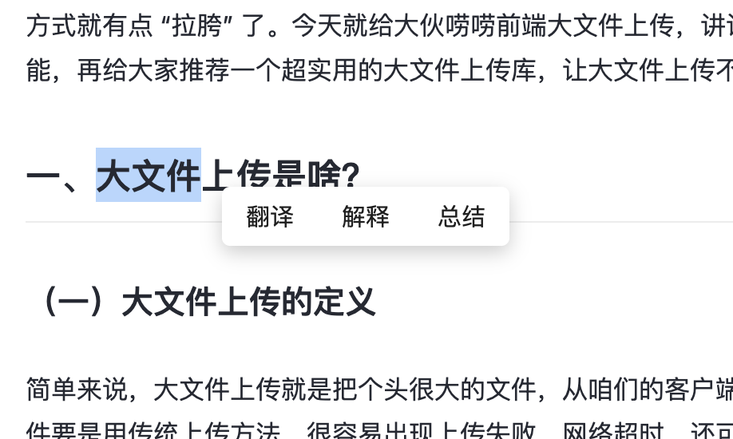
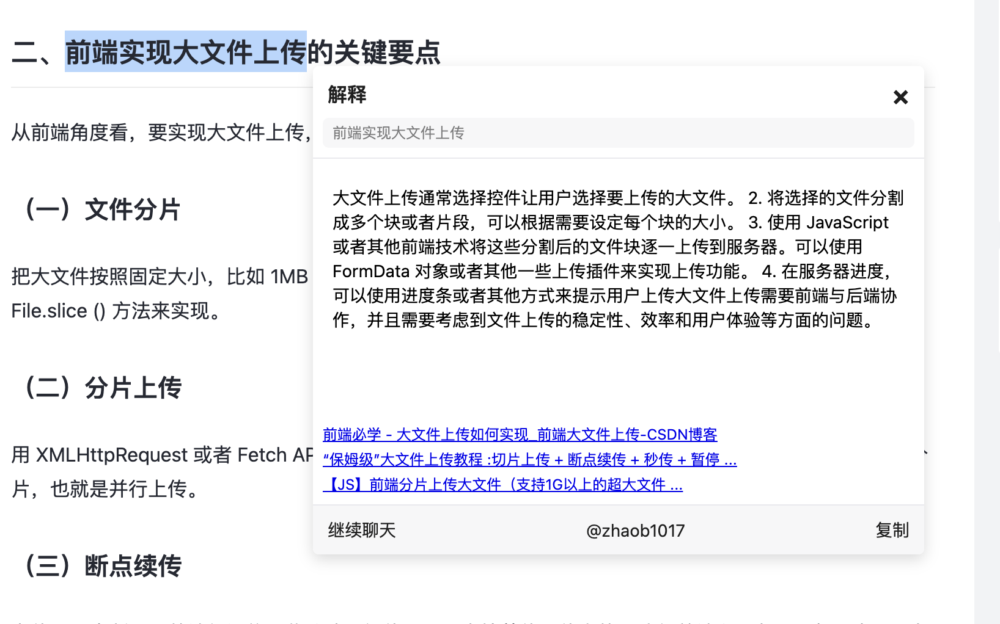
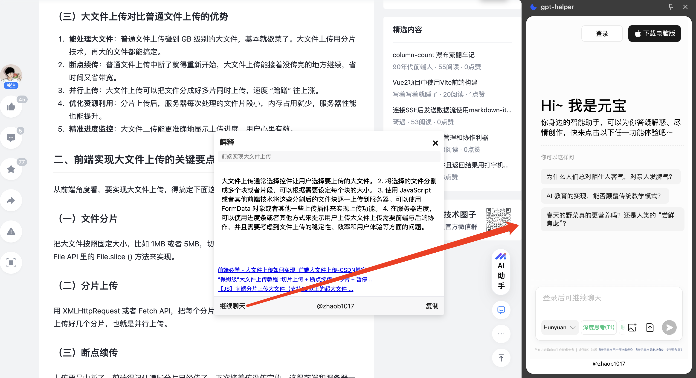
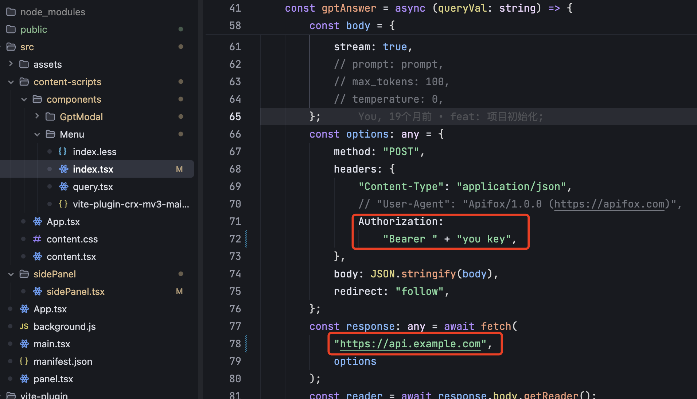

# GPT Helper Chrome 扩展

## 🚀 功能特性

### demo 示例；

#### 鼠标划词选中可选项：



#### AI 解释 + 网页搜索内容：



#### 侧边栏可集成任意 AI 网站：



### 核心功能

- 网页文本即时翻译（中英互译）
- 选中文本智能解释
- 文本内容摘要生成
- Bing 搜索结果集成展示
- 可拖拽交互式悬浮窗

### 辅助功能

- 网页内容脚本注入
- 浏览器事件监听系统
- WebSocket 实时通信
- GPT-3.5 Turbo API 集成

## 🛠️ 技术栈

### 前端

- 框架：React + TypeScript
- 构建工具：Vite
- 样式预处理器：Less
- 浏览器 API：Chrome Extension MV3

### 服务

- AI 引擎：GPT-3.5 Turbo API
- 搜索集成：Bing Search API
- 通信协议：WebSocket

## 📂 项目结构

```bash
.
├── src/
│   ├── content-scripts/            # 内容脚本核心逻辑
│   │   ├── components/             # React组件
│   │   │   ├── GptModal/           # GPT交互弹窗
│   │   │   └── Menu/               # 右键菜单组件
│   │   ├── App.tsx                 # 主应用入口
│   │   └── content.css             # 全局样式
│   ├── assets/                     # 静态资源
│   ├── manifest.json               # 扩展清单配置
│   └── popup.html                  # 扩展弹出页
├── vite-plugin/                    # 自定义Vite插件
│   └── src/
│       ├── client/                 # WebSocket客户端
│       └── index.ts                # 插件主逻辑
├── package.json
└── vite.config.ts
```

## Usage

### 安装依赖

vite-plugin 需要先安装依赖，并 build，后续对项目安装依赖，支持动态刷新插件

### 配置自定义 AI 接口



```bash
# development
pnpm dev

# production
pnpm build
```
